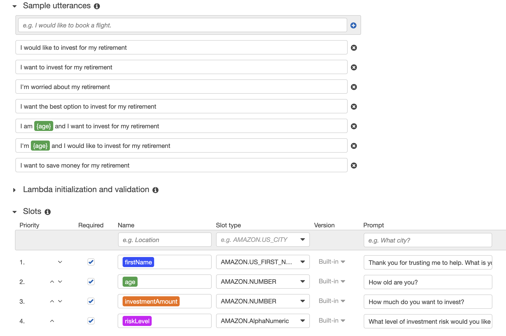
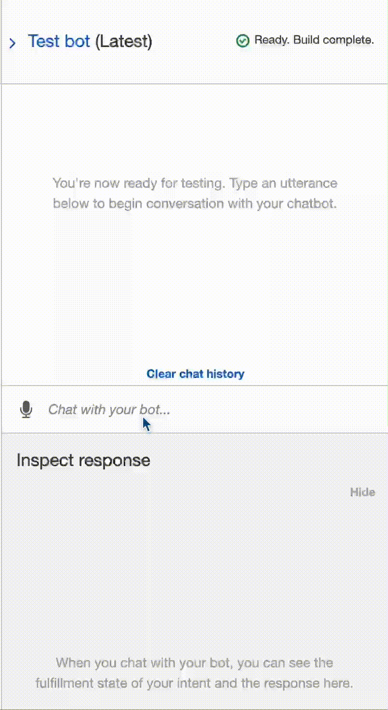
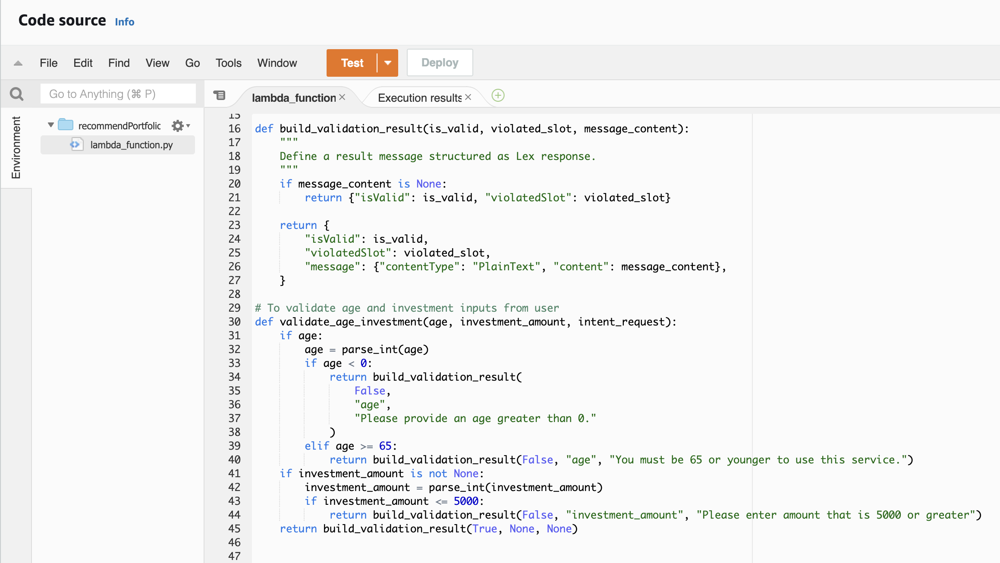
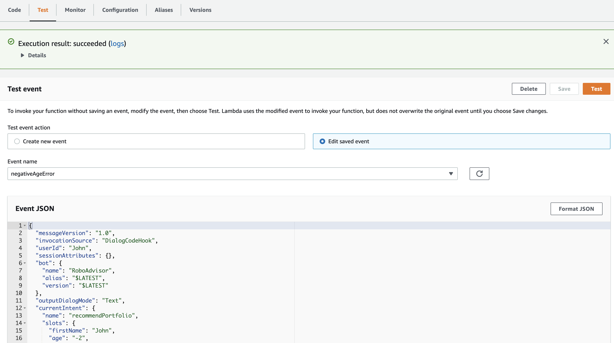
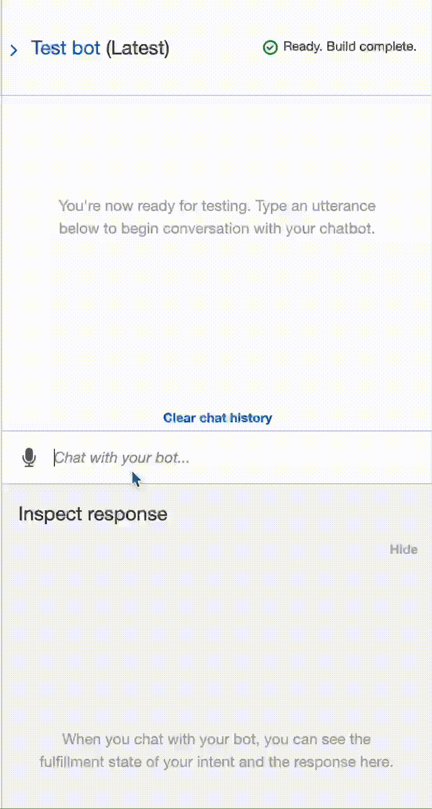

# Robo Investment Advisor

This program is a RoboAdvisor build in AWS, using Amazon Lex and Lambda functions, to provide customized investment plans.

----

## Technologies
This RoboAdvisor was created in the AWS console. The tools used were Amazon Lex (v1), and Amazon Lambda. The Lambda function used in this program was written in Python 3.7.

[Amazon Lex](https://docs.aws.amazon.com/lex/index.html)  |  [Amazon Lambda](https://docs.aws.amazon.com/lambda/index.html)

----

## Installation Guide
This bot was entirely configured in Amazon Web Services. To duplicate this process, the user must have an AWS account. You can create a personal account [here](https://aws.amazon.com/premiumsupport/knowledge-center/create-and-activate-aws-account/).

----

## Configuration

**3 parts:**

1. Configure the Inital Robo Advisor

- Open Amazon Lex and build a custom bot
- Create an intent with utterances and slots
    

2. Build and Test the Robo Advisor
    

3. Enhance the Robo Advisor with a Lambda Function

- Open Amazon Lambda and create a new function
- Edit code in lambda_function.py to validate the user's inputs and produce an investment recommendation
    
- Test with test cases in JSON format
    
- Add tested function to the Amazon Lex intent in the *Fulfillment* section
- Run enhanced bot
    

----

## Contributors

Arlie Jones

[E-mail](arliejones98@gmail.com)  |  [LinkedIn](https://www.linkedin.com/in/arlie-jones-020092159/)

----

## License

None